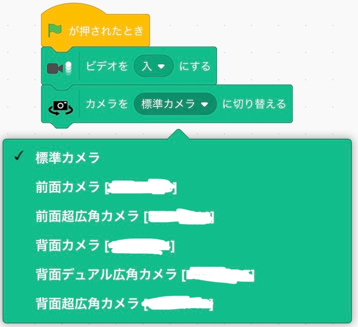

# CameraSelector
The extension for [Xcratch](https://xcratch.github.io/)

Make the camera selectable. This is an extension to help with extensions that use all cameras.

## 🌟 この拡張機能でできること

このカメラセレクター拡張機能を使用すると、以下のことができます：

- 利用可能なカメラデバイスのリストを取得
- 特定のカメラを選択して使用
- フロントカメラやバックカメラなど、カメラの向きを指定
- プロジェクト内で複数のカメラを切り替え

これにより、ユーザーは複数のカメラを使用するプロジェクトを簡単に作成できます。例えば、顔認識と物体検出を同時に行うプロジェクトなどに活用できます。

## 💡 使用方法

1. Xcratchエディタでプロジェクトを開きます。
2. 「拡張機能を追加」ボタンをクリックします。
3. 「カメラセレクター」拡張機能を選択します。
4. カメラ選択ブロックがスクリプトエリアに追加されます。
5. カメラ選択メニューから使用したいカメラを選択します。
6. 他のカメラ関連ブロックと組み合わせて、プロジェクトを作成します。

詳細な使用方法や具体的な例については、以下のサンプルプロジェクトをご覧ください。

## 📷 サンプルプロジェクト

以下は、カメラセレクター拡張機能を使用した[サンプルプロジェクト](https://xcratch.github.io/editor/#https://tfabworks.github.io/xcx-cameraselector/projects/example.sb3)のスクリーンショットです。



このプロジェクトでは、複数のカメラを切り替えながら、それぞれのカメラからの映像を処理しています。ユーザーはドロップダウンメニューから使用したいカメラを選択でき、選択したカメラからの映像がステージに表示されます。


## ✨ What You Can Do With This Extension

Play [Example Project](https://xcratch.github.io/editor/#https://tfabworks.github.io/xcx-cameraselector/projects/example.sb3) to look at what you can do with "CameraSelector" extension.
<iframe src="https://xcratch.github.io/editor/player#https://tfabworks.github.io/xcx-cameraselector/projects/example.sb3" width="540px" height="460px" allow="camera"></iframe>


## How to Use in Xcratch

This extension can be used with other extension in [Xcratch](https://xcratch.github.io/).
1. Open [Xcratch Editor](https://xcratch.github.io/editor)
2. Click 'Add Extension' button
3. Select 'Extension Loader' extension
4. Type the module URL in the input field
```
https://tfabworks.github.io/xcx-cameraselector/dist/cameraselector.mjs
```

## Development

### Register on the local Xcratch

Run register script to install this extension on the local Xcratch for testing.

```sh
npm run register
```

### Bundle into a Module

Run build script to bundle this extension into a module file which could be loaded on Xcratch.

```sh
npm run build
```

## 🏠 Home Page

Open this page from [https://tfabworks.github.io/xcx-cameraselector/](https://tfabworks.github.io/xcx-cameraselector/)


## 🤝 Contributing

Contributions, issues and feature requests are welcome!<br />Feel free to check [issues page](https://github.com/tfabworks/xcx-cameraselector/issues).
